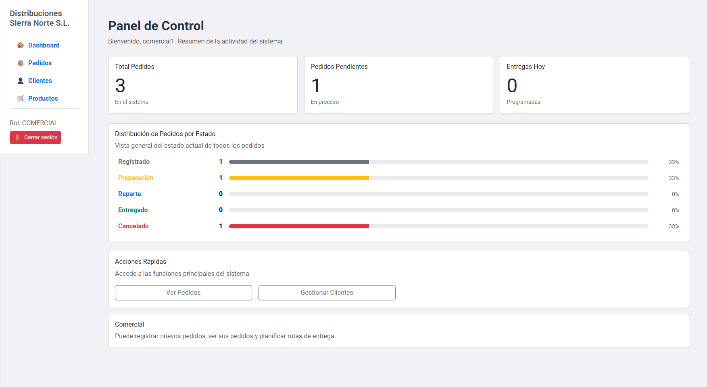
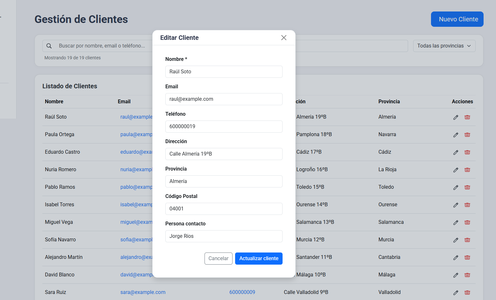
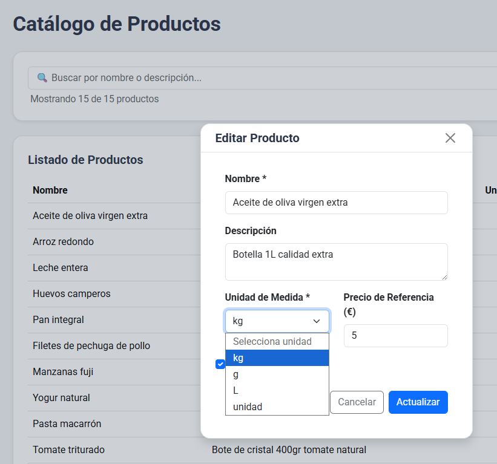
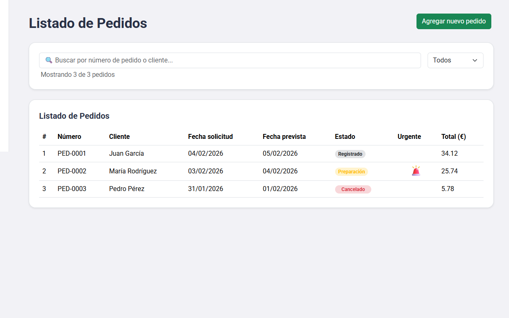

<h1 align="center">📦 Distribuciones Sierra Norte S.L. 🚀</h1>

<p align="center">
  <b>Mejora de la Gestión de Pedidos y Seguimiento</b>
</p>

---

## 📝 Documentos base del proyecto

- 📋 <b><a href="docs/pdf/AnálisisFuncionalyRequisitos.pdf">Análisis de requisitos</a></b>
- 👤 <b><a href="docs/pdf/HistoriasUsuario.pdf">Historias de usuario</a></b>
- 🛠️ <b><a href="./disenio-tecnico.md">Diseño técnico y propuesta tecnológica</a></b>

---

## 🖼️ Capturas de Pantalla Principales

<p align="center">
  <b>Dashboard</b><br>
  <br>
  <i>Puedes arrastrar aquí tu captura de dashboard.</i>
</p>

<p align="center">
  <b>Clientes</b><br>
  <br>
</p>

<p align="center">
  <b>Productos</b><br>
  <br>
</p>

<p align="center">
  <b>Pedidos / Detalle Pedido</b><br>
  <br>
</p>


## 🌍 Estructura del Proyecto

```
repo-root/
├── backend/        # API REST, negocio y seguridad
├── frontend/       # SPA Angular: UX, roles y lógica
├── memory-bank/    # Contexto vivo: arquitecturas, decisiones, insights
├── docs/screenshots/ # ⇦ Arrastra aquí tus imágenes
```

---

## 🚦 Quickstart

|                         | 🔙 Backend                      | 🔜 Frontend                   |
|-------------------------|---------------------------------|-------------------------------|
| **Instalación**         | `cd backend`<br>`npm install`   | `cd frontend/frontend`<br>`npm install` |
| **Ejecutar**            | <b>`npm start`</b> <br> | `npm start`    |
| **Tests Unitarios**     | `npm test`                      | `npm test`                    |


---

## ✨ Tecnologías Principales

- <b>Frontend:</b> Angular 21+, RxJS, SCSS, SPA modular y responsive.
- <b>Backend:</b> Node.js >=18, Express, PostgreSQL, Autenticación JWT, patrones REST.
- <b>Testing:</b> Automatizado (`npm test`), archivos en /tests, /test y .spec.ts.
- 🏗️ <b>Extensible</b>: todo el sistema está documentado, modular y fácil de evolucionar.

---

## 👩‍💻 ¿Quieres contribuir o entender más?

- Revisa primero los docs <b>“Análisis de requisitos”</b>, <b>“Historias de usuario”</b> y <b>“Diseño técnico”</b>.
- Código, features y mejoras SIEMPRE respaldados por test unitario correspondiente.

<hr />
